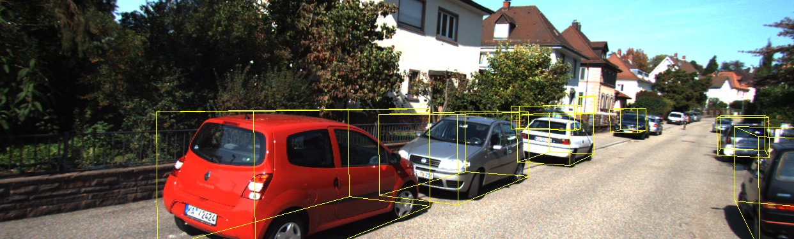
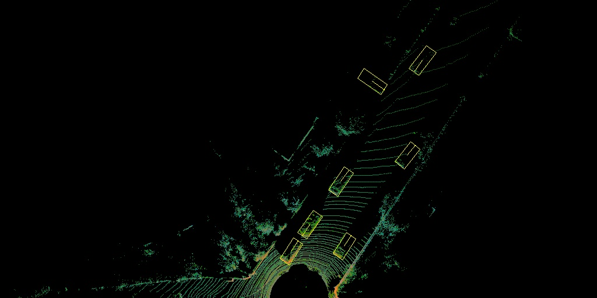

# PointPillars net

Implemetation of pointpillars net point cloud object detection neural network on the ZCU 102 FPGA board using VITIS AI. 

Built for human detection, trained on KITI dataset. Results shown below.

PP net output:

Lidar birds eye view:

More infor about PointPillars can be found at: https://arxiv.org/abs/1812.05784
